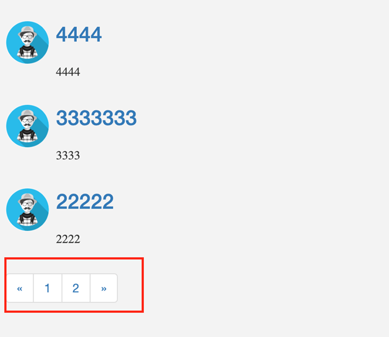

# CITS5505GroupProject

Group project for CITS5505 - Agile Web Development

## Application Purpose (Design and Use Explanation)

The purpose of the website: On our website, users can post any questions they want to ask and reply to anyone's posts. They can communicate freely. And there will be a point ranking based on the number of likes received.

## Group Member

| UWA ID   |     Name      | Github Username |
| -------- | :-----------: | --------------: |
| 23715251 | Rongchuan Sun |    Rongchuansun |
| 23794373 |  Yiming Cai   |       FrogCai66 |
| 23665044 |   Ziqi Wang   |    Weatherl1ght |
| 23731411 |   Haoyu Li    |      sudekidesu |

## How to Launch Application

1. Create virtual environment
   1. For Windows/Mac
      > python3 -m venv venv
2. Activate virtual environment
   1. For Windows
      > .\venv\Scripts\activate
   2. For MacOS/Linux
      > .venv/bin/activate
3. Install requirements
   > pip install -r requirements.txt
4. Initiate database
   > flask db init
5. upgrade database
   > flask db upgrade
6. Run the application
   > flask --app application run --debug
7. Open the index url
   1. Go to your browser and type http://localhost:5000/

## How to Run the Tests for the Application

1. Assuming that coverage has been installed in the virtual environment.
2. Run the tests and collect coverage data with the following command:

   coverage run -m unittest test/unit.py
   coverage run -m unittest test/selenium_test.py

3. Generate a coverage report in the terminal:
   coverage report
4. For a more detailed report, generate an HTML coverage report:
   coverage html

## Page list

1. Firstly, you need to click login button in home page.
   

2. Click create an account button in login page.
   

3. You need to enter your username, email and password to register a new user.
   

4. If you register successfully, it will jump to login page, then click log in.
   

5. After login successfully, you can search post by search function. And posts will be in recent question list.
   

6. If you want to ask question, click ask question button in home page. You need to enter the title, category and content for your question, then click publish. Your question will appear under recent question list.
   
   

7. If you want to commit any post, just click its title. It will jump to post details page. If you like the post, you can click the small hand icon. And the user will get 1 point. You can enter what you want to commit in commit area. After clicking publish, it will appear in commit area.
   
   
   

8. If you only view posts by committed, you click recent answer. Then these posts will be show under recent answer.

9. Highest point displays users ranking depends on the points they earn. The top five will be displayed.
   

10. You can view different posts freely by clicking page number.
    

## Feature List

- create account
- log in account
- post question
- search your interested qustion, comment and click "like"
- rank for all users

## Possible additional feature?

- User Profile Customization: Allow users to customize their profiles with avatars, bios, and personal interests.
- Notifications: Provide notifications for new comments, likes on their questions, and updates from followed users.
- Private Messaging: Enable private messaging between users for more direct communication.
- Tags and Categories: Implement a tagging system to categorize questions, making it easier for users to find relevant content.

## Tutorial or Reference Used

1. https://flask.palletsprojects.com/en/3.0.x/tutorial/layout/
